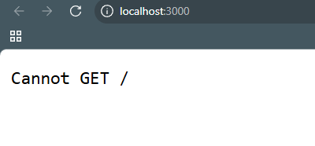

# 🚀 Introduction to ExpressJS

**ExpressJS** is a powerful and widely-used web framework for **Node.js**, designed to simplify building web applications and RESTful APIs. It offers a minimalist yet flexible toolkit for handling HTTP requests, routing, middleware, and much more.

## ✨ Key Features

- ✅ Flexible routing for handling various HTTP methods and URL patterns.
- ✅ Middleware support for streamlined request/response processing.
- ✅ Easy integration with databases and other Node.js libraries.
- ✅ Massive community support and extensive documentation.

## 📦 package.json Breakdown

```json
{
  {
  "name": "01-setup-intro",
  "version": "1.0.0",
  "main": "index.mjs",
  "scripts": {
    "test": "echo \"Error: no test specified\" && exit 1",
    "start:dev": "nodemon ./src/index.mjs",
    "start": "node ./src/index.mjs"
  },
  "keywords": [],
  "author": "",
  "license": "ISC",
  "description": "",
  "dependencies": {
    "express": "^5.1.0"
  },
  "devDependencies": {
    "nodemon": "^3.1.10"
  },
  "type": "module"
}
```

### 🔍 Explanation

* **`name`**: Project name.
* **`version`**: Current version of the project.
* **`main`**: Entry point (mostly relevant when publishing as a package).
* **`type`**: Enables ES Module support (allows using `import`/`export`).
* **`scripts`**:

  * `start`: Run the app using Node.js.
  * `start:dev`: Run the app with **nodemon** for live reloading during development.
  * `test`: Default test script placeholder.
* **`dependencies`**:

  * `express`: Web framework used to build the app.
* **`devDependencies`**:

  * `nodemon`: Tool for automatically restarting the server on code changes.


## Preview
