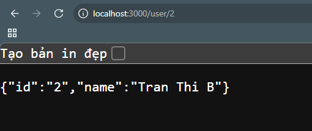

# 🛣️ Route Parameters in ExpressJS

**Route parameters** in ExpressJS allow you to capture values from the URL and use them in your route handlers. This is useful for accessing specific resources, such as a user by their ID.

## 🚦 How Route Parameters Work

You define a route parameter by adding a colon (`:`) followed by the parameter name in the route path. The value in that position of the URL will be available in `req.params`.

### Example

```js
import express from "express";

const app = express();
const PORT = process.env.PORT || 3000;

const users = [
  { id: "1", name: "Nguyen Van A" },
  { id: "2", name: "Tran Thi B" },
  { id: "3", name: "Le Van C" },
];

app.get("/", (req, res) => {
  res.send("hello world ");
});

app.get("/user", (req, res) => {
  res.send(users);
});

// Route with parameter
app.get("/user/:id", (req, res) => {
  const { id } = req.params;
  const user = users.find(u => u.id === id);
  if (user) {
    res.send(user);
  } else {
    res.status(404).send("Not found");
  }
});

app.listen(PORT, () => {
  console.log(`Server is running on http://localhost:${PORT}`);
});
```

## 📝 Explanation

- `/user/:id`: The `:id` part is a route parameter. It matches any value in that segment of the URL.
- `req.params`: An object containing all route parameters as key-value pairs.
- In the example, `/user/2` will return the user with `id: "2"`, or a 404 error if not found.

## 🔎 Use Cases

- Fetching a user by ID: `/user/1`

## 🖼️ Preview
